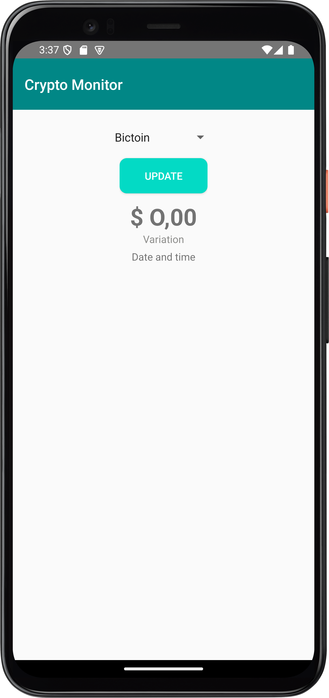
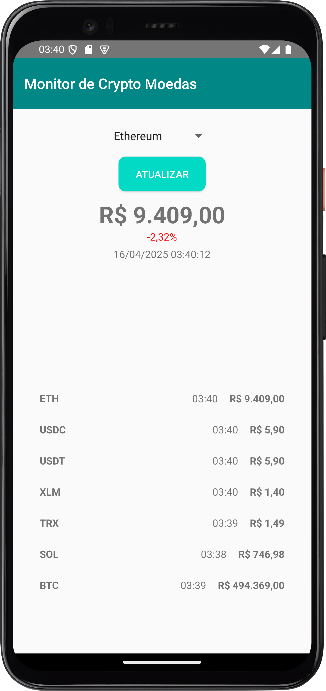

# 🪙 Android Crypto Monitor

APP nativo Android de monitoração de cryptos utilizando APIs 

## Screenshots

 

## Como Testar
_A versão do Android deve ser no mínimo 8.1_

- Ative fontes desconhecidas no seu dispositivo:

`Configurações > Segurança e privacidade > Instalar apps desconhecidos > Ative a permição no seu APP de preferência`

- Baixe o APK disponível em: `apks/crypto_monitor.apk` ou em _releases_ (v1.0.0)

## Stack Utilizada

- Kotlin
- Android Studio
- Gradle
- Destaque de dependências:
  - Retrofit2
  - Retrofit2 Gson Converter
  - Kotlinx Coroutines
- APIs:
  - [MercadoBitcoin](https://api.mercadobitcoin.net/api/v4/docs)
  - [EconomiaAwesomeAPI](https://economia.awesomeapi.com.br/)

## Estrutura do projeto (simplificada)

```
├───java
│   └───lucaslimb.com.github.cryptomonitor
│           ├───adapter
│           ├───model           
│           ├───service    
│           ├───ui        
│           └───MainActivity.kt                             
└───res
    ├───drawable
    ├───layout
    ├───values
    └───xml
```
