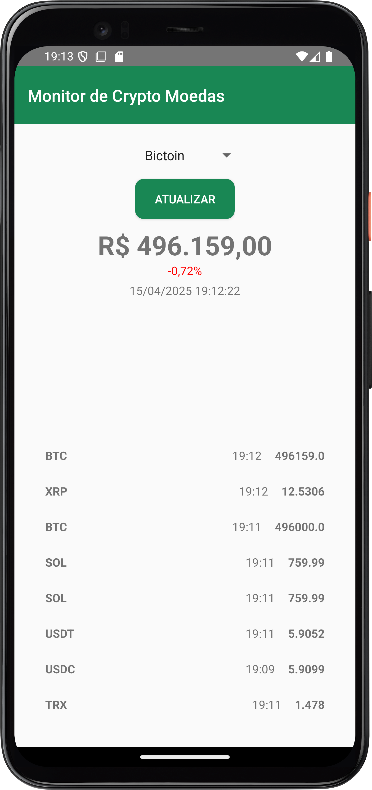

# 🪙 Android Crypto Monitor

APP de monitoração de cryptos utilizando a API do MercadoBitcoin

## Screenshot

## Stack Utilizada

- Kotlin
- Android Studio
- Gradle
- Destaque de dependências:
  - Retrofit2
  - Retrofit2 Gson Converter
  - Kotlinx Coroutines
- API:
  - [MercadoBitcoin](https://api.mercadobitcoin.net/api/v4/docs)
 
## Como Testar

- Ative fontes desconhecidas no seu dispositivo:

**Configurações > Apps e notificações > Avançado > Acesso especial a apps > Instalar apps desconhecidos > *Ative a permição no seu APP de preferência***

- Baixe o APK disponível em:

`releases/download/v1.0/crypto_monitor.apk`

